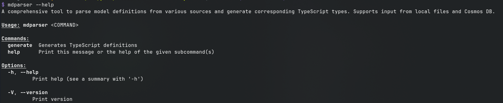
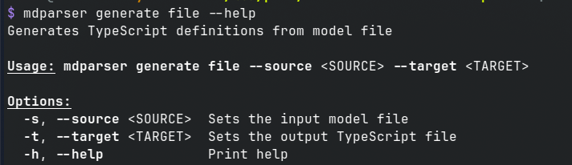
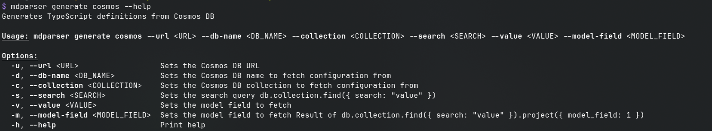

# Model Parser


## Overview

**Model Parser** is a comprehensive tool designed to parse model definitions from various sources and generate corresponding TypeScript types. It supports input from local files as well as Cosmos DB. This tool makes it easy to convert model definitions into TypeScript types, streamlining the development process.

## Features

- **File-based Model Parsing**: Parse model definitions from local files and generate TypeScript types.
- **Cosmos DB Integration**: Fetch model definitions from Cosmos DB and generate TypeScript types.
- **Automatic Directory Creation**: Automatically create necessary directories if they don't exist.
- **Pretty-printed Output**: Generate well-formatted and readable TypeScript definition files.

## Table of Contents

- [Installation](#installation)
- [Usage](#usage)
  - [File-based Model Parsing](#file-based-model-parsing)
  - [Cosmos DB Model Parsing](#cosmos-db-model-parsing)
- [Contributing](#contributing)
- [License](#license)

## Installation

### Prerequisites

- [Rust](https://www.rust-lang.org/tools/install) (latest stable version)
- [MongoDB](https://www.mongodb.com/try/download/community) (for Cosmos DB integration)

### Building from Source

1. Clone the repository:

    ```sh
    git clone https://github.com/StanMarek/rust-model-definition-parser mdparser
    cd mdparser
    ```

2. Build the project:

    ```sh
    make build
    ```
    or
    ```sh
    cargo build
    ```

3. Install the executable:

    ```sh
    make release
    ```

4. Running executable:
    ```sh
    mdparser
    ```

5. Running in debug mode:
    ```sh
    cargo
    ```

## Usage

### General Help

```sh
mdparser --help
```


### File-based Model Parsing
Generate TypeScript definitions from a local model file:

```
mdparser generate file --source path/to/model.txt --target path/to/output.ts
```
```
mdparser generate file --source model.txt --target output.ts
```


### Cosmos DB Model Parsing - still work in progress
Fetch model definitions from Cosmos DB and generate TypeScript types:

```
mdparser generate cosmos --url mongodb://localhost:27017 --db_name mydb --collection mycollection --search myfield --value myvalue --model_field mymodel
```
```
mdparser generate cosmos --url mongodb://localhost:27017 --db_name mydb --collection mycollection --search id --value 12345 --model_field myModelField
```


## Contributing
I welcome contributions!

1. Fork the repository.
2. Create a new branch (git checkout -b feature-branch).
3. Make your changes.
4. Commit your changes (git commit -am 'Add new feature').
5. Push to the branch (git push origin feature-branch).
6. Create a new Pull Request.

## License
This project is licensed under the MIT License. See the LICENSE file for details.

Made with ❤️ by Stan Marek


